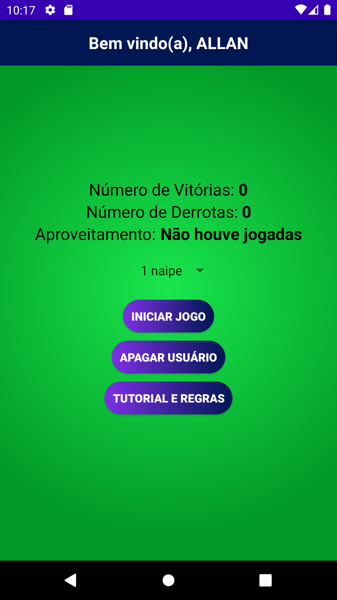
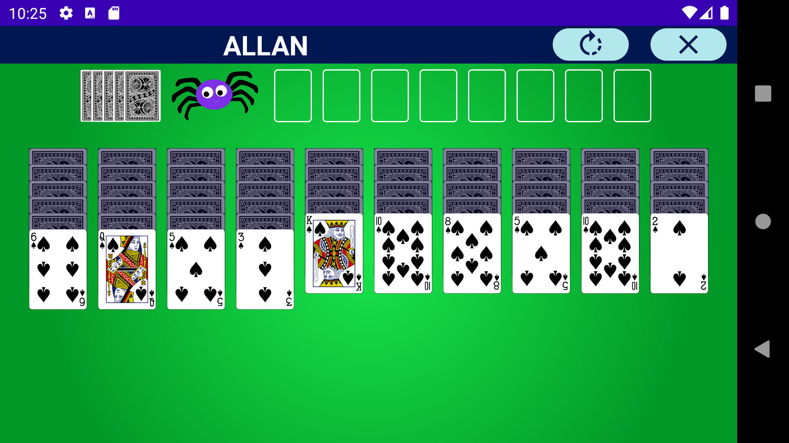

<a href="README_portuguese.md" target="_blank">Leia esta página em português</a>

# Paciência Spider

### It is an application to play the Spider Solitaire card game, the user can select 1, 2 or 4 suits to play, the application makes use of an API called Deck of Cards, in which it is possible to generate personalized decks, shuffle, distribute and return the cards to the deck.

### Data is saved locally using SharedPreferences.

#### Technologies used:
 </a>

#### Download Application: [Paciência Spider](https://github.com/AllanBismarck123/Paciencia-Spider/raw/main/paciencia-spider.apk)

#### Application screens:
  
  
