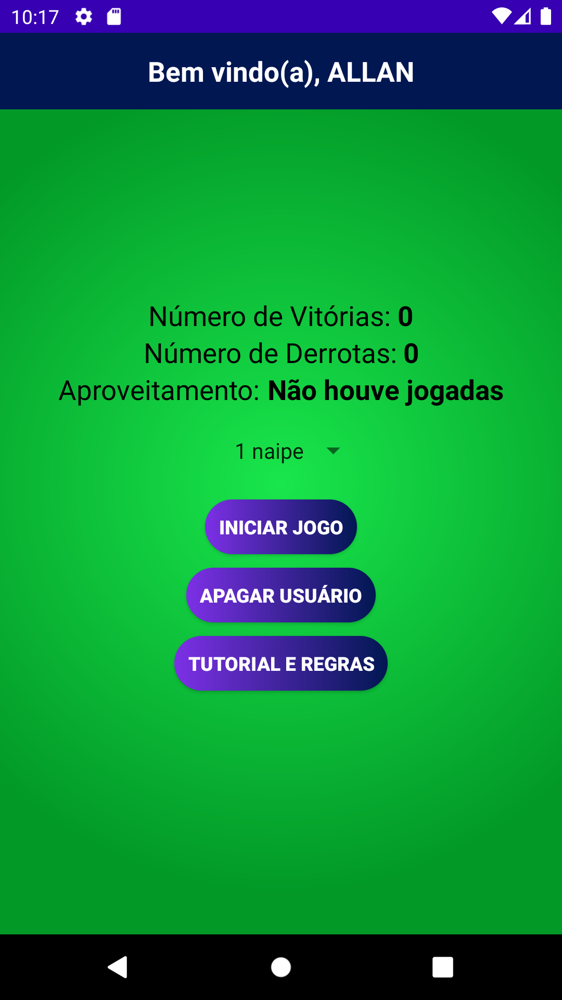
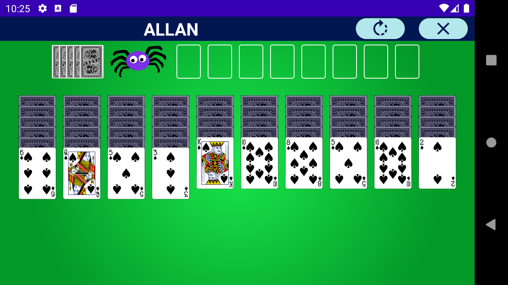

<a href="README.md" target="_blank">Read this page in english</a>

# Paciência Spider

### É um aplicativo para jogar o jogo de cartas Paciência Spider, o usuário pode selecionar 1, 2 ou 4 naipes para jogar, a aplicação faz um uso de uma API chamada Deck of Cards, nela pode-se gerar baralhos personalizados, embaralhar, distribuir e retornar as cartas ao baralho.

### Os dados são salvos localmente utilizando SharedPreferences.

#### Technologies used:
 </a>

#### Download Application: [Paciência Spider](https://github.com/AllanBismarck123/Paciencia-Spider/raw/main/paciencia-spider.apk)

#### Application screens:
  
  
